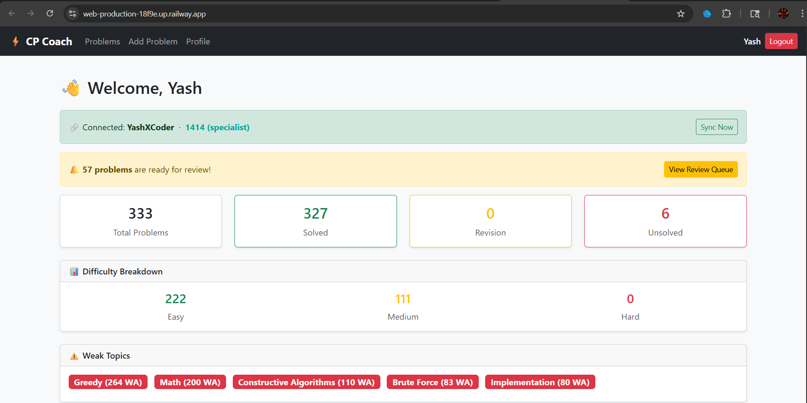
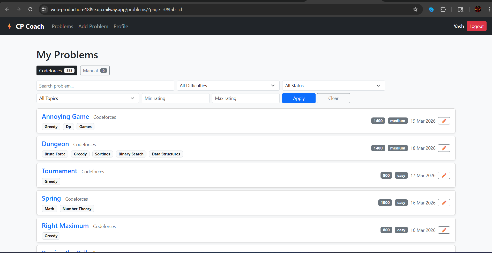
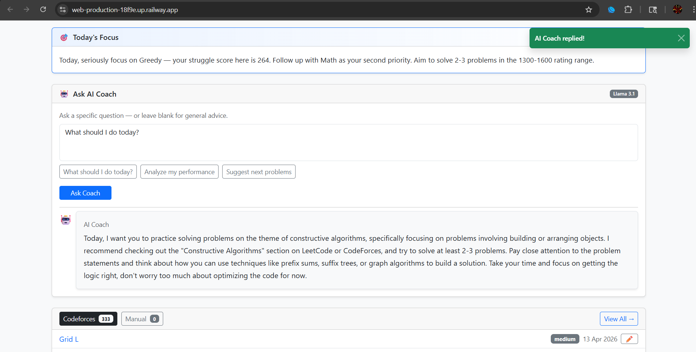
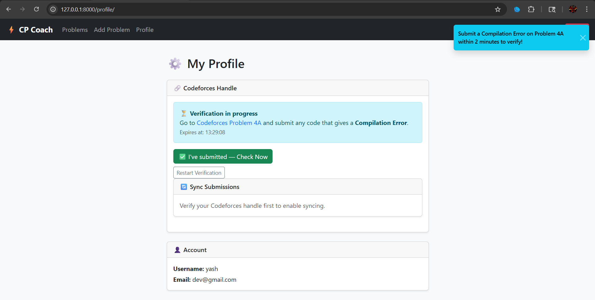

# ⚡ Smart CP Coach

A Django-based competitive programming coaching platform that syncs your Codeforces submissions, identifies weak topics, and provides AI-powered improvement suggestions.

🔗 **Live Demo:** [web-production-18f9e.up.railway.app](https://web-production-18f9e.up.railway.app/)

---

## 📸 Screenshots

### Dashboard


### Problem List


### AI Coach
 

### Profile & CF Verification
 

---

## ✨ Features

- **Codeforces Sync** — Automatically fetches accepted submissions, wrong attempts (WA/TLE/RE), ratings, and tags from the Codeforces API
- **CF Handle Verification** — Verifies handle ownership by checking for a Compilation Error submission on a specific problem within a 2-minute window
- **Weak Topic Analysis** — Identifies topics where you struggle most based on cumulative wrong attempt data
- **AI Coach** — Ask questions and get personalized advice powered by Llama 3.1 8B via OpenRouter
- **Today's Focus** — Rule-based daily suggestion generated instantly from your weak topic data
- **Review Queue** — Priority-based problem queue using a custom scoring algorithm (wrong attempts + rating + days since practiced)
- **Problem Tracker** — Track Codeforces and manually added problems with search, filters, and pagination
- **Toast Notifications** — Real-time feedback on all user actions

---

## 🛠️ Tech Stack

| Layer | Technology |
|---|---|
| Backend | Django 5.2, Python 3.13 |
| Database | SQLite (dev), PostgreSQL ready |
| Frontend | Bootstrap 5, Vanilla JS, AJAX |
| AI | Llama 3.1 8B Instruct via OpenRouter |
| CF Integration | Codeforces API |
| Deployment | Railway |

---

## 🚀 Local Setup

```bash
git clone https://github.com/YashXTensei/smart-cp-coach.git
cd myproject
pip install -r requirements.txt
```

Create a `.env` file in the root:
```env
SECRET_KEY=your-django-secret-key
OPENROUTER_API_KEY=your-openrouter-api-key
```

```bash
python manage.py migrate
python manage.py runserver
```

---

## ⚙️ Environment Variables

| Variable | Description |
|---|---|
| `SECRET_KEY` | Django secret key |
| `OPENROUTER_API_KEY` | OpenRouter API key for AI Coach |

---

## 📁 Project Structure

myproject/
├── core/
│   ├── models.py          # UserProblem, Problem, Topic, UserProfile
│   ├── views/
│   │   ├── auth.py        # Login, logout, signup
│   │   ├── dashboard.py   # Dashboard + AI Coach endpoint
│   │   ├── problems.py    # CRUD for problems
│   │   └── profile.py     # CF handle verification + sync
│   ├── utils/
│   │   ├── ai_coach.py    # OpenRouter API + rule-based suggestions
│   │   ├── topics.py      # Weak topic analysis
│   │   └── priority.py    # Review priority scoring
│   ├── templates/
│   ├── static/
│   │   └── core/
│   │       └── toast.js
│   └── cf_api.py          # Codeforces API integration
├── manage.py
└── requirements.txt

---

## 🗺️ Roadmap

- [x] Codeforces sync with WA tracking
- [x] Weak topic analysis
- [x] AI Coach (Llama 3.1)
- [x] CF Handle verification system
- [x] Review priority queue
- [ ] SM-2 spaced repetition algorithm
- [ ] Performance analytics and charts
- [ ] Leaderboard
- [ ] Mobile responsive improvements

---

## 👤 Author

**Yash** — [@YashXTensei](https://github.com/YashXTensei)

> Built as a personal tool to improve Codeforces rating from Pupil to Expert 🎯